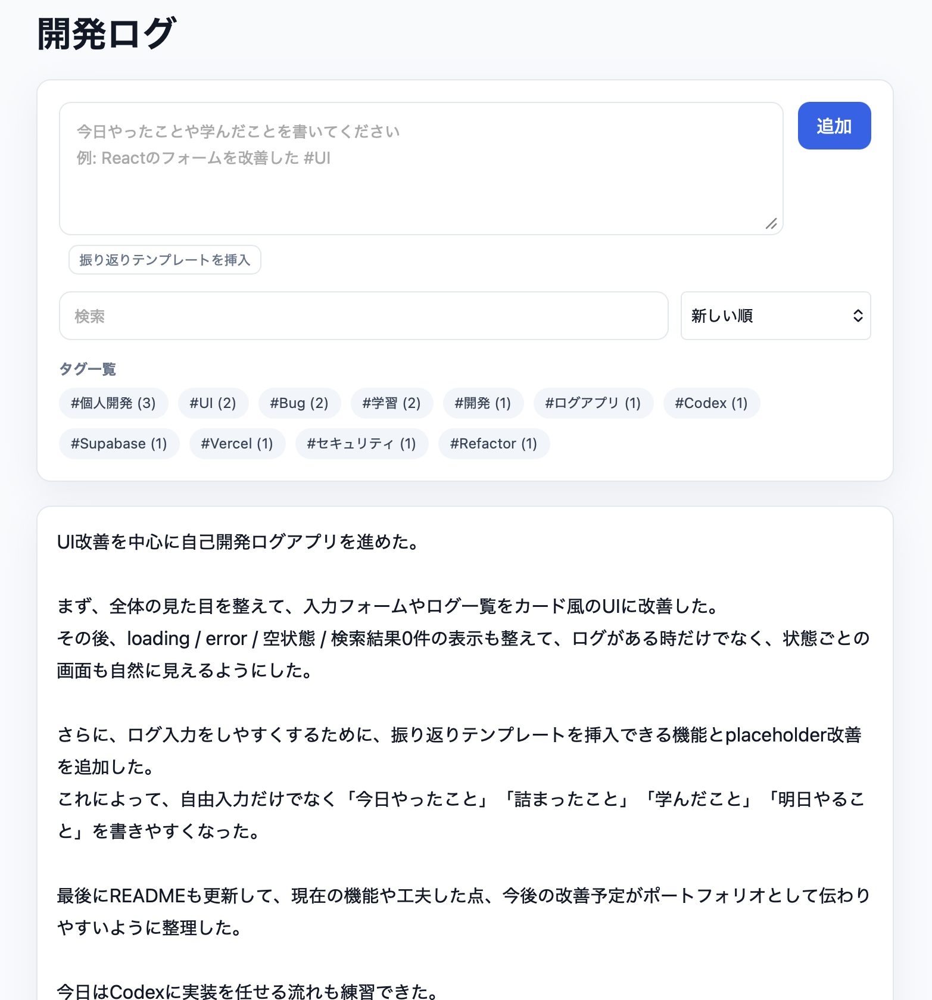

# Dev Log App

日々の学習や開発内容を記録し、あとから振り返れる自己開発ログアプリです。

## URL

https://dev-log-app-omega.vercel.app

## 概要

エンジニアとしての成長を可視化するために、日々の作業ログを簡単に記録・管理できるアプリを作成しました。

ログはSupabaseに保存し、複数行入力、タグ自動提案、検索、並び替え、状態表示に対応しています。日々の作業内容だけでなく、詰まったことや学んだことも残しやすいように、振り返りテンプレートも用意しています。

## スクリーンショット



## 主な機能

- ログの作成 / 編集 / 削除
- Supabaseによるログ保存
- textareaによる複数行ログ入力
- Enterで改行
- Cmd + Enter / Ctrl + Enterでログ追加
- 入力中の文字数・タグ数表示
- よく使うタグをチップからワンクリックで本文に追加
- 入力内容に応じたおすすめタグの自動提案
- ログ追加時に未入力のおすすめタグを本文末尾へ自動付与
- 振り返りテンプレートの挿入
- キーワード検索
- タグ検索
- `#タグ` 形式のタグ自動抽出
- タグ一覧とタグごとの件数表示
- 新しい順 / 古い順の並び替え
- loading / error / 空状態 / 検索結果0件の表示
- レスポンシブを意識したカード型UI

## 使用技術

- Next.js
- React
- TypeScript
- Supabase
- Vercel

## セットアップ

リポジトリをクローンします。

```bash
git clone <repository-url>
cd dev-log-app
```

依存関係をインストールします。

```bash
npm install
```

`.env.local.example` をコピーして `.env.local` を作成します。

```bash
cp .env.local.example .env.local
```

`.env.local` にSupabaseの接続情報を設定します。

```bash
NEXT_PUBLIC_SUPABASE_URL=https://your-project.supabase.co
NEXT_PUBLIC_SUPABASE_ANON_KEY=your-supabase-anon-key
```

開発サーバーを起動します。

```bash
npm run dev
```

ブラウザで `http://localhost:3000` を開きます。

## Supabase

このアプリでは `logs` テーブルを使用します。

主なカラムは次の通りです。

- `id`: ログのID
- `text`: ログ本文
- `date`: 作成日時
- `tags`: タグ配列

Supabaseの接続情報は環境変数で管理し、実際のURLやanon keyはリポジトリに含めない構成にしています。

## 工夫した点

- ログ操作を `useLogs` にまとめ、UIとデータ操作の責務を分けています。
- Supabaseへのアクセス処理を `lib/supabase/logs.ts` に分離しています。
- 表示対象のログを作る検索・ソート処理を `utils/getVisibleLogs.ts` に切り出しています。
- タグ抽出、タグ集計、タグ推定を `utils` に分け、UIから独立した形にしています。
- textarea、Cmd/Ctrl + Enter、振り返りテンプレートにより、複数行の開発ログを書きやすくしています。
- ログを書きながら文字数やタグ付け状況を確認できるようにしています。
- 入力内容からおすすめタグを表示し、ログ追加時に未入力のタグだけ自動付与することで、タグ入力の手間を減らしています。
- よく使うタグをチップで追加できるようにし、同じタグは重複して追加されないようにしています。
- loading / error / 空状態 / 検索結果0件をカード風に表示し、データ状態が自然に伝わるUIにしています。
- 入力フォーム、タグ、ログ一覧をカードやチップで整理し、ポートフォリオとして見やすい画面に整えています。

## 今後の改善予定

- Supabase Authを導入し、ユーザーごとのログ管理に対応
- RLSポリシーをユーザー単位に制限
- AIによるログ分析・振り返り機能の検討
- UI/UXの継続改善
- テストの追加

## 開発背景

日々の学習内容や開発記録を残したいと考えた際、手軽に使えて継続しやすいツールが欲しいと思い、本アプリを開発しました。

ポートフォリオとして、Reactの状態管理、コンポーネント分割、Supabase連携、入力UX改善、状態表示設計を確認できる構成にしています。
